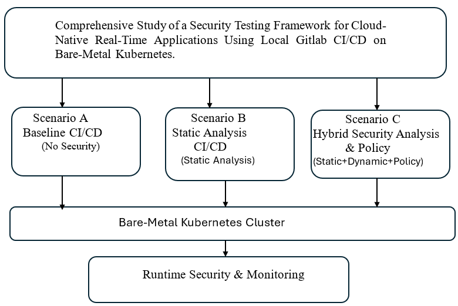
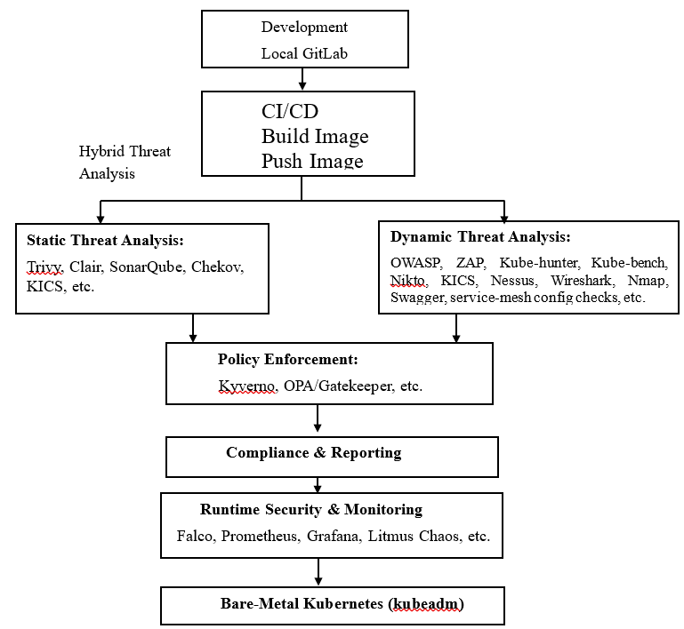

# Master-Thesis-TH-Cologne:
 
# Implementation and Comparative Evaluation of a Security Testing Framework for Cloud-Native Industrial Microservices in Bare-Metal Kubernetes Environments.

## Overview

The framework integrates static and dynamic threat analysis directly into local GitLab CI/CD pipelines, enabling continuous vulnerability detection, compliance enforcement, and operational monitoring.

# Security Testing Framework for Cloud-Native Real-Time Applications  
### Using Local GitLab CI/CD on Bare-Metal Kubernetes

## Overview

This project presents an automated security testing framework designed for real-time, cloud-native applications deployed on bare-metal Kubernetes clusters. The framework integrates static and dynamic threat analysis directly into local GitLab CI/CD pipelines, enabling continuous vulnerability detection, compliance enforcement, and operational monitoring.

---

## Table of Contents
- [Overview](#overview)
- [Motivation](#motivation)
- [Objectives](#objectives)
- [Research Questions](#research-questions)
- [Methodology](#methodology)
- [Architecture Diagrams](#architecture-diagrams)
- [Expected Outcomes](#expected-outcomes)
- [Conclusion](#conclusion)
- [Usage / Repo Structure](#usage--repo-structure)

---

## Motivation

Industrial applications require stringent security and real-time performance. Traditional manual or cloud-only DevSecOps methods fall short for on-premises environments. This framework addresses the gap by automating security testing within local CI/CD pipelines while maintaining operational efficiency.

---

## Objectives

- Design a modular, extensible security testing framework for local CI/CD pipelines.  
- Integrate static and dynamic analysis, policy enforcement, and real-time monitoring.  
- Evaluate the framework under various configurations on bare-metal Kubernetes.  
- Measure the trade-offs between security effectiveness, compliance, and performance.  
- Provide practical guidance for industrial DevSecOps adoption.

---

## Research Questions

- How does integrated static and dynamic security testing affect vulnerability detection and compliance?  
- What are the operational costs of different pipeline strategies?  
- How effective is automated policy enforcement compared to manual methods?  
- What challenges exist when scaling DevSecOps for on-premises real-time systems?  
- How to balance security and performance for certification readiness?

---

## Methodology

We implemented and tested four pipeline types on bare-metal Kubernetes:

| Pipeline Type | Description                            |
|---------------|------------------------------------|
| Baseline      | No security integration             |
| Static-only   | Static code/image vulnerability scanning |
| Dynamic-only  | Runtime threat detection and scanning |
| Hybrid        | Combined static, dynamic, and policy enforcement |

---

## Architecture Diagrams

### Comparative Pipeline Scenarios  
  
*Visual comparison of Baseline, Static-only, Dynamic-only, and Hybrid pipelines.*

### System Architecture Overview  
  
*Shows integration of GitLab CI/CD, security tools, container registry, and bare-metal Kubernetes.*

---

## Expected Outcomes

- Fully automated security testing pipelines for real-time, on-prem deployments.  
- Empirical evaluation of security effectiveness, deployment speed, and resource usage.  
- Tooling and templates for compliance automation and certification readiness.  
- Practical insights and recommendations for industrial DevSecOps adoption.

---

## Conclusion

This framework advances secure, efficient microservice deployment for on-premises real-time applications, directly supporting Fraunhofer IPT's digitalization goals. It delivers measurable security improvements without compromising performance or developer agility.

---

## Usage / Repo Structure

- `/src` — Application source code  
- `/security` — Security scanning and policy configs  
- `/ci` — GitLab CI/CD pipeline configurations  
- `/k8s` — Kubernetes deployment manifests  
- `/monitoring` — Prometheus & Grafana setups  
- `/figures` — Diagrams and architecture visuals  

---

**For questions or contributions, contact:** mdhazrat.thkoeln.it@gmail.com

